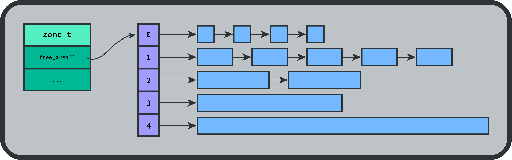
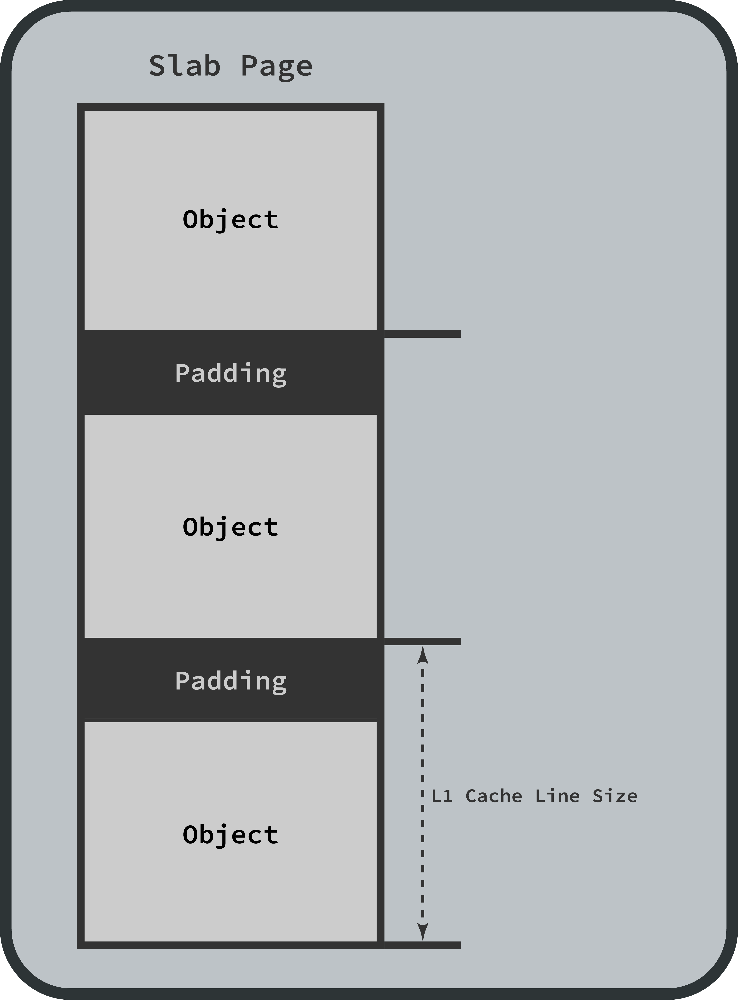

# Homework 1---Linux Memory Management

**Author: Cayden Lund (u1182408)**

The Linux kernel uses layers of strategies to manage memory in a way that's very effective.
It uses layers of strategies to allocate and deallocate memory for different purposes: it uses a buddy allocator to allocate and free large ranges of pages infrequently, and a slab allocator to allocate and free smaller, shorter-lived objects in a way that avoids memory fragmentation and is cache-friendly.
In this article, I seek to describe the organization of memory management in Linux in a useful way, with concrete details of data structures and algorithms, with the hope that this makes for a helpful reference.

Note that this document represents the current state of the Linux kernel and API, v6.10.10.


## Table of Contents

* [Pages, Page Frames, and Page Descriptors](#pages%2C-page-frames%2C-and-page-descriptors)
* [Memory Nodes and Zones](#memory-nodes-and-zones)
* [The Buddy Allocator](#the-buddy-allocator)
* [The Slab Allocator](#the-slab-allocator)
* [Virtual Memory](#virtual-memory)
* [`vmalloc`](#vmalloc)


## Pages, Page Frames, and Page Descriptors

The Linux kernel organizes the system's physical memory as a collection of **page frames**.
Each page frame is a fixed-length contiguous block of physical memory.
Each of these is `PAGE_SIZE` bytes in size (usually `0x1000` bytes---4 KiB---depending on the CPU architecture's page size).

**Pages**, on the other hand, represent a fixed-length (`PAGE_SIZE` bytes) block of contiguous _virtual memory_.
Pages are mapped to page frames.
These are the common unit for managing memory throughout the Linux kernel.

In the kernel, each physical page frame in the system has a unique **page descriptor**---`struct page`---associated with it to keep track of how the page frame is being used.
This descriptor states whether its page frame is free, reserved, or in use, what it's being used for, and some page-type-specific metadata.
These page descriptors are stored in an array of all page descriptors, and the index of each entry, called the **page frame number**, is used throughout the kernel as a unique identifier for that page frame.
The location of this page descriptor depends on whether the kernel is configured for a UMA or a NUMA system; I will go into more detail about the differences later, but for now let's say that for most sytems, this array of page frame descriptors is stored in the `mem_map` global variable, declared in file [`mm/memory.c` (link to source)](https://elixir.bootlin.com/linux/v6.10.10/source/mm/memory.c#L103) and initialized in file [`mm/mm_init.c` (link to source)](https://elixir.bootlin.com/linux/v6.10.10/source/mm/mm_init.c#L1625).

In the kernel, a page frame is described by `struct page`, in file [`include/linux/mm_types.h` (link to source)](https://elixir.bootlin.com/linux/v6.10.10/source/include/linux/mm_types.h#L74).
The fields from this data type are included below, with detailed added descriptions:

```C
// This massive nest of `union`s is to keep `sizeof(struct page)` small.
// Modern systems have millions of these that are always allocated,
// so the datatype variants must be overlaid on top of each other like this.
struct page {
    // These encode the state of the page---whether it is locked or dirty,
    // or has been allocated as a slab, or is the head of a compound page,
    // or is mapped into an `mlock`-ed region, etc.
    unsigned long flags;

    // This is a 5-word union.
    // The first word is used to implement compound pages;
    // bit 0 of the first word is set to 1 in this case.
    // Otherwise, bit 0 must be set to 0; other than that,
    // this union can pretty much be used as free storage for 
    // metadata specific to a page type.
    union {
        // Page cache and anonymous pages:
        struct {
            // An "active" pageout least-recently-used (LRU) list:
            // The most recently-used page is put as the head of this linked list,
            // and the tail of the list becomes the least-recently-used page.
            union {
                // The head of the LRU list.
                struct list_head lru;

                // The "LRU list" slot.
                struct {
                    // Bit 0 must be unset here to avoid false reports as a `PageTail()`.
                    void *__filler;

                    // The number of mlocks on this page or folio.
                    unsigned int mlock_count;
                };

                // Otherwise, this is a free page.
                // Choosing one of these two options clarifies
                // the kind of free page.
                struct list_head buddy_list;
                struct list_head pcp_list;
            };

            // A pointer to some kind of cacheable, mappable object.
            // See `include/linux/page-flags.h` for page mapping flags.
            struct address_space *mapping;

            union {
                // Our offset within the mapping.
                pgoff_t index;

                // The share count of this mapping.
                unsigned long share;
            };

            // This is a number used for something page-type-specific:
            // for `PagePrivate`, this is used for `buffer_heads`;
            // for `PageSwapCache`, this is used for `swp_entry_t`;
            unsigned long private;
        };

        // `page_pool` used by netstack.
        // Not particularly relevant to memory management.
        struct { /* ... */ };

        // Tail pages of a compound page.
        struct {
            // This value encodes the head page of this compound page.
            // Bit zero is set to identify this as a tail page!
            unsigned long compound_head;
        };

        // `ZONE_DEVICE` pages.
        // These are special pages belonging to a specific device.
        struct {
            // Pointer to the host device's pagemap.
            struct dev_pagemap *pgmap;

            // An arbitrary pointer to device data.
            void *zone_device_data;
        };

        // This is a wrapper around a callback for a "Read, Copy, Update" operation.
        struct rcu_head rcu_head;
    };

    // If mappable to userspace, this value tracks the number of times that the page
    // is mapped by a page table.
    // Otherwise, identifies the page type.
    union {
        // If the page can be mapped to userspace, then this is the count of times
        // that this page is referenced by a page table.
        // Users shouldn't access this directly---instead, use accessor methods
        // like `page_mapcount()`.
        // Slab pages (which can't be mapped to userspace) can reuse this field
        // for other purposes.
        atomic_t _mapcount;

        // If this page is not a page slab and is not mappable to userspace,
        // then this value can give a hint of what this page is used for.
        // See `include/linux/page-flags.h` for details of page types that set this.
        // https://elixir.bootlin.com/linux/v6.10.10/source/include/linux/page-flags.h
        unsigned int page_type;
    };

    // The reference count of this page.
    // Newly-allocated pages have a refcount of 1.
    // When the reference count reaches 0, the page is returned to the page allocator.
    // Use accessors like `get_page()`.
    // This is partially speculative; don't rely on this value being stable.
    atomic_t _refcount;
}
```


## Memory Nodes and Zones

A memory **node** describes a bank of physical memory.
On Non-Uniform Memory Access (NUMA) systems with a multi-socket board (i.e., a multi-CPU system), memory may be arranged in banks that incur a different access cost depending on the distance from a processor---accessing local memory is faster than accessing remote memory.
In many NUMA machines, each CPU might have its own local bank of memory.
Therefore, in such a NUMA machine, different nodes are different banks of memory, local to different physical processors.
On UMA machines with only a single memory bank, there is only a single node.

In the kernel, a node is described by `struct pglist_data`, also aliased as `pg_data_t`.
NUMA machines allocate these node structures early in the boot process, each one typically stored on its respective bank.
UMA machines, on the other hand, have a single static `pg_data_t` structure, which is named `contig_page_data`.
This data structure is defined in file [`include/linux/mmzone.h` (link to source)](https://elixir.bootlin.com/linux/v6.10.10/source/include/linux/mmzone.h#L1277).
Relevant fields from this data type are included below, with added annotations:

```C
// Each memory bank has one of these describing its memory layout.
typedef struct pglist_data {
    // Contains all zones for this node.
    // Not all are necessarily populated.
    // I'll detail what exactly is stored in a `struct zone` below.
    struct zone node_zones[MAX_NR_ZONES];

    // Contains references to all zones in all nodes.
    // This is essentially just an array of references to zones,
    // ordered by the what the allocator should try to use first.
    struct zonelist node_zonelists[MAX_ZONELISTS];

    // The number of populated zones in this node.
    int nr_zones;

    // The first page frame number for this node.
    unsigned long node_start_pfn;

    // The total number of physical pages for this node.
    unsigned long node_present_pages;

    // The total size of the physical page range for this node,
    // including holes.
    unsigned long node_spanned_pages;

    // The unique ID number of this node.
    int node_id;

    // A number of pages are kept "reserved", unavailable for userspace allocations,
    // to help ensure that the kernel never becomes absolutely starved of resources.
    // This is the count of reserved pages in this node.
    unsigned long totalreserve_pages;
} pg_data_t;
```

The entire physical address space is divided per node into a number of **zones**, which are categorized ranges of phyical memory that are usually determined by hardware specifications and limitations.
Zones are designed to optimize memory allocation for different purposes and types of hardware.
There's a number of different _types_ of zones, named in `enum zone_type` in file [`include/linux/mmzone.h` (link to source)](https://elixir.bootlin.com/linux/v6.10.10/source/include/linux/mmzone.h#L729):

* `ZONE_DMA` and `ZONE_DMA32`:
    These are used when there are peripherals that aren't able to directly able to access the entire addressable memory (i.e., `ZONE_NORMAL`) due to hardware constraints..
    On architectures where this area covers the whole 32-bit address space, `ZONE_DMA32` is used; otherwise, `ZONE_DMA` is used.

* `ZONE_NORMAL`:
    This is normal addressable memory, directly accessible by the kernel and hardware using regular addresses.

* `ZONE_HIGHMEM`:
    In some systems, the kernel isn't able to directly reach the entire address space using regular addresses.
    This happens on 32-bit systems with more than 4GB of RAM.
    Sometimes, the kernel might be configured to have a lower "highmem" boundary than strictly necessary; for example, it may be set to 900MB for the i386 architecture.
    In these cases, page frames above the "highmem" boundary (which can't be accessed directly using normal addresses) are described by this kind of zone, and a special page table is used by the kernel to access those page frames indirectly.

* `ZONE_MOVABLE`:
    This zone is similar to `ZONE_NORMAL`, except that pages are guaranteed to be _movable_ (with a few exceptions)---this is used for pages that are allowed to be swapped to disk, for example.

* `ZONE_DEVICE`:
    This is a special kind of page corresponding to a particular hardware device.
    This allows a device to have a persistent region of memory for direct I/O operations, among other things.

In the kernel, zones are described by a `struct zone` data structure, also aliased as `zone_t`, in file [`include/linux/mmzone.h` (link to source)](https://elixir.bootlin.com/linux/v6.10.10/source/include/linux/mmzone.h#L824).
Relevant fields are listed below, with added annotations and descriptions:

```C
// This describes a zone, a specific region of page frames belonging to a node.
// The buddy allocator interacts with this data structure a lot.
struct zone {
    /* Read-mostly fields */

    // This field reserves a portion of lower memory zones to prevent situations
    // where higher memory zones have plenty of free pages while lower zones are full.
    // This array holds ratios of each zone type, and is dynamically adjusted.
    long lowmem_reserve[MAX_NR_ZONES];

#ifdef CONFIG_NUMA
    // On a NUMA system, this states the ID of the node that owns this node.
    int node;
#endif

    // A pointer to the descriptor of the node that owns this zone.
    struct pglist_data *zone_pgdat;

    // This is the page frame number of the first page frame in this zone.
    unsigned long zone_start_pfn;

    // This counts the number of page frames in this zone that are managed
    // by the buddy allocator.
    atomic_long_t managed_pages;
    // This represents the total number of pages that this zone spans,
    // including any holes.
    unsigned long spanned_pages;
    // This represents the total number of pages that are present in this zone,
    // not including any holes.
    unsigned long present_pages;

    // This stores the (textual) name of this node.
    // Can be useful in logs/debugging.
    const char *name;

    // States whether this zone has been initialized.
    int initialized;

    // This is a `free_area` array for use by the buddy allocator.
    // I'll get into the details of that later, but essentially it tracks
    // contiguous regions of page frames that the buddy allocator will use.
    // Each entry stores a pointer to a free region and the count of free regions
    // of the respective size, where the size is `(2 ** index)`.
    struct free_area free_area[NR_PAGE_ORDERS];

    // This holds flags for the zone, which represent attributes like whether this
    // is a high-memory zone or is managed by the buddy allocator.
    unsigned long flags;

    // Indicates whether the memory in this zone is contiguous.
    bool contiguous;
};
```

A visualization of a node, zones, and page frame descriptors is included.
Note that this is for an UMA system, so there is only one node; for a NUMA system, it would be virtually identical, but there would be multiple nodes, and each node would have its own arrays of page frame descriptors and zones.

<p align="center">
    
</p>


## The Buddy Allocator

The Linux **buddy allocator** is used for the allocation and deallocation of memory pages.
It works on the principle of dividing memory into chunks of various sizes, where each chunk size is a power of two.
The way it works is fairly straightforward: at a high level, when the user requests a size, it calculates the number of page frames needed rounded up to a power of 2, and looks for an appropriately-sized chunk of memory.
If one is not found, then a larger one is split (recursively as needed).
When a block is split, the two new smaller blocks are called "buddies", and when both "buddy" blocks have been freed, they are rejoined into a single larger block.

The buddy allocator tracks chunks of memory using an array of linked lists.
This array is unique for each zone---the `free_area[]` field in `struct zone` is where it's stored.
At index `i` in the array, if there is a free chunk of memory `(2 ** i)` pages in size, then there is a pointer to the start of a region of that size.
That chunk of memory then holds a pointer to the next chunk of that size, and so on, forming a linked list of free chunks of size `(2 ** i)`.

When the buddy allocator is invoked, it rounds the requested size of memory to the next power of two, divides it by the page size (4KiB), and uses the base-2 logarithm of the quotient as an index in an array.
That is, `index = log_2(req_size / 4096)`.
For example, a request of 10,000 would be rounded up to 16,384, and then `index = log_2(16384 / 4096) = log_2(4) = 2`.

# Mention how PFs contain ptrs for merging/splitting. Show data structures and methods. Illustration.
Then, the buddy allocator looks at entry `freelist[index]` in its array of free lists.
If there is a free chunk of that size (i.e., if `freelist[index]` is not null), then it removes that chunk from the free list: `freelist[index] = freelist[index]->next`.
The newly-removed chunk will be marked as allocated and returned.
If there was not a chunk of that size in the free list, though, then a chunk of the next-largest size is split, and this is done recursively as needed.
When a chunk is split, it is removed from the linked list of its size and split into two equal halves.
One half is returned, and the other half is added to its free list (according to its new size).
These two halves are called "buddies".
Finally, the list of page frames is updated to report that the corresponding pages of memory are allocated, and a pointer to the beginning of the chunk is returned.

When a chunk is freed, the buddy allocator checks whether that block's buddy is free.
If its buddy is not free, then it's simply added to the free list entry for its size (i.e., the appropriate linked list in the `freelist[]` array).
If its buddy is free, though, then it's merged with its buddy: the buddy is removed from its free list, and the two chunks are rejoined into a single large chunk; merging continues recursively until a chunk's buddy is not free (or it reaches the max size), and then the resulting larger chunk is added to its appropriate free list.

<p align="center">
    
</p>


## The Slab Allocator

The **slab allocator** was first introduced in the Solaris kernel, and has widely been adopted across UNIX-like operating systems, including Linux.
It speeds up allocating and freeing by using pre-allocated blocks of memory ("slabs") to handle requests.
It has three primary goals:

**1. Avoid memory fragmentation from using the buddy allocator:**
    The buddy allocator is excellent for infrequent allocations and deallocations of memory in multiples of the page size (4 KiB), but its performance suffers when smaller allocations are needed, when allocations and deallocations are frequent, and most importantly, when chunks of memory are not freed in order.
    When buddy-allocated chunks of memory are not freed in order, then the memory space suffers from fragmentation; smaller blocks of memory aren't able to be merged when their buddies aren't freed, and so larger blocks of memory grow rarer in the free list.

**2. Cache commonly-used objects so that the system does not waste time allocating, initializing, and destroying objects:**
    For many kernel data structures, the time it takes to initialize an object is significant.
    When a new slab is created, a number of objects are packed into the slab and initialized if a constructor is available.
    When an object is freed, it is left in its initialized state, so that if it gets re-allocated later, it doesn't need to be initialized again from scratch.

**3. Align memory allocations in a cache-friendly way:**
    If there is room in the slab after subtracting the size of the objects to pack, the remaining space is _colored,_ a scheme that adds padding between packed objects in an attempt to make objects from different slabs use different lines in the cache.
    By changing the starting offsets of the objects in the slab, it's likely that objects will use different CPU cache lines, meaning that they won't flush each other out of the cache.
    With this scheme, the leftover space (that would otherwise be wasted) is made useful for cache-friendliness.
    An illustration of this alignment is as follows:

<p align="center">
    
</p>

In Linux, there have been three implementations of the slab allocator:
- **SLAB** was the first implementation of the slab allocator.
    It worked well, and managed memory effectively with little overhead.
    It was deprecated in kernel v6.5, and removed completely in kernel v6.8, because the SLUB allocator outperforms it.
- **SLUB** was the next implementation of the slab allocator.
    It was far simpler than SLAB, in terms of both code complexity and metadata overhead.
    When the procedures were developed, multi-core systems had become more commonplace, and so the procedures were developed to work efficiently on multi-core processors.
    It performs better than SLAB in many metrics.
    Best of all, it was a drop-in replacement for SLAB; it shared the same API.
    It was made the default in kernel v2.7 (2008), but users could compile a kernel with SLAB if desired until kernel v6.8, when it was removed.
- **SLOB** was the third implementation of the slab allocator.
    It was designed to minimize memory overhead for embedded systems.
    It was removed in kernel v6.4.

Now that SLUB is the only slab allocator in the Linux kernel, this section
will refer to it specifically.

At a high level, the slab allocator is organized as a hierarchy of three tiers:
1. A cache of objects, `struct kmem_cache`, manages a linked list of slabs.
    All of the cache's slabs are the same size and divided into the same number of sections.
    A linked list of caches is stored in the global variable `slab_caches`.
    The cache tracks slabs in one of two states: full or partial.
    Note that the SLAB allocator used to consider empty slabs as a third kind of state; now, the SLUB allocator considers them identical to other "partial" slabs.
2. A slab (described by `struct slab`) is a contiguous block of memory that stores multiple objects.
    Slabs are allocated by Buddy, so their size is `(2 ** n)` pages for some `n`.
    A slab is evenly divided into a number of sections, and each section holds one object.
3. Objects are stored in the sections of a slab.
    All objects in the slab are the same size---enough to fill most of the corresponding section, but no more than the section size.

First, let's cover `struct kmem_cache`, which is defined in [`mm/slab.h` (link to source)](https://elixir.bootlin.com/linux/v6.10.10/source/mm/slab.h#L251).
Relevant fields from this data type are included below, with annotated explanations.
```C
// Represents a slab cache.
// Tracks filled, partially-filled, and empty slabs.
struct kmem_cache {
    // A pointer to an array of `kmem_cache_cpu`.
    // The length of this array is the number of CPUs
    // on the system---that is, each CPU has a corresponding
    // `struct kmem_cache_cpu` data structure.
    // This data structure keeps an "active" slab handy for allocating an object.
    // I'll go into more detail later.
    struct kmem_cache_cpu __percpu *cpu_slab;

    // This is a set of flags that describe the type of this cache's slabs.
    // I'll go into more detail later.
    slab_flags_t flags;

    // The minimum number of partial (or empty) slabs to keep around.
    // If there are at least this many allocated partial slabs,
    // then when a slab is emptied, it will be deallocated using buddy.
    // Otherwise, hang onto that slab so that it's readily accessible
    // for object allocation.
    unsigned long min_partial;

    // This is the total size of an allocated object in bytes, including metadata.
    // Since the SLUB allocator usually doesn't use metadata,
    // this is typically the same as `object_size`.
    unsigned int size;

    // This is the size of an allocated object in bytes, not including metadata.
    unsigned int object_size;

    // This is related to reciprocal division, a performance optimization
    // to reduce the number of divisions done.
    // Because the cache's `size` field doesn't change, we can calculate this
    // on initialization and multiply by this value instead of dividing by `size`.
    // The datatype and related methods are defined in `include/linux/reciprocal_div.h`
    // and implemented in `lib/math/reciprocal_div.c`.
    struct reciprocal_value reciprocal_size;

    // This is the "free pointer offset".
    // In a non-full slab, there is a linked list structure of free objects.
    // In a free object, the pointer to the next free object is at byte `offset`.
    unsigned int offset;

    // Again, I'll go into more detail about `struct kmem_cache_cpu` later,
    // but `CONFIG_SLUB_CPU_PARTIAL` configures it to track a per-CPU
    // list of partially-filled slabs.
    // This can have some performance benefits, but also introduces
    // some unpredictability in the latency of a `kmalloc` call.
#ifdef CONFIG_SLUB_CPU_PARTIAL
    // The number of per-CPU partially-filled objects to keep around.
    unsigned int cpu_partial;

    // The number of per-CPU partially-filled slabs to keep around.
    unsigned int cpu_partial_slabs;
#endif

    // This structure is just a wrapper around an `unsigned int`.
    // It holds two pieces of information:
    //   - The "order" of the slab size---i.e., `n` in `slab_size = 2 ** n`.
    //     `oo_order` is a helper function to extract this number from the upper bits.
    //   - The number of objects that each slab holds.
    //     `oo_objects` is a helper function to extract this number from the lower bits.
    struct kmem_cache_order_objects oo;

    // These are the GFP ("Get Free Page") flags to pass to the buddy allocator
    // when requesting memory for a new slab.
    // These flags govern the behavior of the allocator
    // as well as a few other system components.
    // Use `GFP_KERNEL` to allocate kernel memory, `GFP_USER` for user memory,
    // and `GFP_RECLAIM` for slabs that, when empty,
    // are allowed to automatically be reclaimed when the system is running low on memory.
    // I won't go into detail for what these flags are, but the kernel documentation
    // is pretty comprehensive
    // (https://www.kernel.org/doc/html/latest/core-api/memory-allocation.html).
    gfp_t allocflags;

    // This is an optional pointer to an object constructor.
    // Whenever a new slab is allocated, this function is called on every object region.
    void (*ctor)(void *object);

    // Align data in multiples of this amount.
    unsigned int align;        /* Alignment */

    // A human-readable name for this cache.
    // This isn't used internally, but it can be useful
    // for diagnostics or runtime examination.
    const char *name;

    // This forms a linked list of all `kmem_cache`s in the system.
    // It's the same as the global variable `slab_caches`.
    struct list_head list;

    // For each node in the system (NUMA systems have multiple, UMA systems have one),
    // there's a pointer here to a `kmem_cache_node`,
    // which comprehensively tracks all partially-filled slabs in this node.
    // I'll go into more detail about this data structure later.
    struct kmem_cache_node *node[MAX_NUMNODES];
};
```

As you can see, most of these fields are rather straightforward.
The `struct kmem_cache` holds a pointer to a list of `struct kmem_cache_cpu` (one for each CPU) and a list of pointers to `struct kmem_cache_node` (one for each node).
It also stores some metadata about the slabs that are under its control.

Next, let's go over the `struct kmem_cache_cpu`, which is defined in [`mm/slub.c` (link to source)](https://elixir.bootlin.com/linux/v6.10.10/source/mm/slub.c#L384).
The relevant fields from this data type are included below, with annotated explanations.

```C
// Holds some slab allocator metadata for a particular CPU.
// A single slab is designated the "active" slab;
// the `freelist` field and the `slab` field both point to the current active slab.
struct kmem_cache_cpu {
    // A pointer to the next available object in the current ac
    void **freelist;

    // A pointer to the beginning of the current active slab.
    struct slab *slab;

#ifdef CONFIG_SLUB_CPU_PARTIAL
    // If the kernel was configured for the CPU to track partially-allocated slabs,
    // store a pointer to the head of a linked list of them here.
    struct slab *partial;
#endif
};
```

This is quite simple: the `struct kmem_cache_cpu` keeps a pointer to its designated "active" slab (which is not fully allocated), as well as a pointer to the next free object inside the active slab.
Also, if the kernel was configured to allow it, it keeps a linked list of partially-filled slabs that temporarily belong to this CPU's slab allocator.

Let's look at the `struct kmem_cache_node` data type next.
It's defined in [`mm/slub.c` (link to source)](https://elixir.bootlin.com/linux/v6.10.10/source/mm/slub.c#L425).
The relevant fields from this data type are included below, with annotated explanations.

```C
// Comprehensively tracks all partially-filled slabs in this node.
struct kmem_cache_node {
    // The number of partially-filled slabs.
    unsigned long nr_partial;

    // A linked list of all partially-filled slabs
    // that aren't temporarily in a `kmem_cache_cpu`'s `partial` list.
    struct list_head partial;
};

```

You can't get much simpler than that.

I've prepared a visual illustration of the data structures and how they connect to each other.
It shows what happens when a new object is allocated.

<p align="center">
    
</p>


## Virtual Memory

In Linux, virtual memory is a memory abstraction---virtual **pages** (which are the same size as page frames) are _mapped_ to a corresponding physical page.
This has a number of benefits, including process isolation, the ability to map files as if they were RAM, and the ability to load linked libraries or function calls to the same location of virtual memory, despite the current layout of the physical memory space at runtime.
Virtual address space covers the entire addressable address range (up to `2**64 - 1` on x86-64) and is divided into two halves: user-space and kernel space.
On x86-64 setups, the first 16 bits of virtual addresses are set to 0 for user-space addresses and 1 for kernel-space addresses; the other 48 bits are split equally between user and kernel.
This is architecture- and configuration-specific, but it makes it clear upon human inspection whether a virtual address is user-space or kernel-space.That is to say, user-space virtual memory starts at address `0x0` and continues up to a static maximum (`0x00007fffffffffff`), and kernel-space virtual memory starts at address `0xffff800000000000` and continues up to `0xffffffffffffffff`.

For a virtual address to be used, its page needs to be **mapped** to a physical page---the kernel needs to assign a physical page to the virtual page and record it so that it can do the virtual-to-physical address translation.
The way that Linux maps virtual pages to physical pages is the page table, a hierarchy of levels that are used to do an address translation.
The way that this page table works is pretty simple: a (virtual) address is divided into a number of regions, and each region uses those respective bits as an index into an array for the corresponding level.
According to the [Linux kernel documentation](https://docs.kernel.org/mm/page_tables.html), it currently has five levels, which are the following (from broadest to narrowest):
1. The **Page Global Directory** (PGD), represented by `pgd_t` and `pgdval_t`.
    This is the largest page table.
    There's one for kernel memory (named `swapper_pg_dir`), and each userspace process has its own memory context and therefore its own PGD.
    It has a list of PGD values, which are pointers to P4D tables.
2. The **Page Level 4 Directory** (P4D), represented by `p4d_t` and `p4dval_t`.
    This is only used on architectures that support a 5-level page table, and is otherwise _folded_ (which I will explain later).
    This holds an array of P4D values, which are pointers to PUD tables.
3. The **Page Upper Directory** (PUD), represented by `p4d_t` `p4dval_t`.
    Like the P4D, it's only used on architectures that support a 4-level page table, and is otherwise folded.
    This holds an array of PUD values, which are pointers to PMD tables.
4. The **Page Middle Directory**, represented by `pmd_t` and `pmdval_t`.
    This is the next level of the hierarchy.
    This holds an array of PMD values, which are pointers to PTE tables.
5. The **Page Table Entry**, represented by `pte_t` and `pteval_t`.
    This is the basic level of the hierarchy.
    This holds an array of PTE values, which map a single page of virtual memory to a single page of physical memory.

Each level in the page table hierarchy is simply an array of pointers, and the size of each array is architecture-defined.

<p align="center">
    
</p>


## `vmalloc`

In kernel space, most memory allocations are done through `kmalloc`, which, like `malloc` in user-space, allocates physically contiguous memory.
However, there are cases where physically contiguous memory is either hard to obtain or unnecessary for the task at hand.
If the system has been running for a while, for example, then the memory space might be rather fragmented, which would make a large contiguous allocation difficult or impossible.

This is the purpose of `vmalloc`: unlike `kmalloc`, `vmalloc` provides _virtually_ contiguous memory, meaning that the allocated memory appears contiguous in the virtual address space but the allocated physical memory might be divided across multiple different regions.
This allows the kernel to perform large allocations without neding large contiguous physical chunks of memory.

First, the kernel reserves a contiguous range in the virtual address space.
Then, the kernel sets up the various relevant page tables to map each of the pages in that virtual range to a corresponding physical page.
The CPU can then access the correct physical memory wherever it may be using contiguous virtual addresses.

The way that it's defined in the source code is a little confusing.
It's a macro that calls a function that calls another macro that calls another function, but eventually down the line somewhere you find a method, `__vmalloc_node_range_noprof`, defined in file [`mm/vmalloc.c` (link to source)](https://elixir.bootlin.com/linux/v6.10.10/source/mm/vmalloc.c#L3751).
It's far too long to include the whole thing, but I've included the important bits here:

```C
void *__vmalloc_node_range_noprof(unsigned long size, unsigned long align,
            unsigned long start, unsigned long end, gfp_t gfp_mask,
            pgprot_t prot, unsigned long vm_flags, int node,
            const void *caller)
{
    // (... some variable initialization ...)

    // First, reserve the virtual memory range.
    // If it isn't allowed to fail, then keep looping;
    // otherwise, return NULL.
again:
    area = __get_vm_area_node(real_size, align, shift, VM_ALLOC |
                  VM_UNINITIALIZED | vm_flags, start, end, node,
                  gfp_mask, caller);
    if (!area) {
        bool nofail = gfp_mask & __GFP_NOFAIL;
        if (nofail) {
            schedule_timeout_uninterruptible(1);
            goto again;
        }
        goto fail;
    }

    // Allocate physical pages and map them into the virtual space.
    ret = __vmalloc_area_node(area, gfp_mask, prot, shift, node);
    if (!ret)
        goto fail;

    // And then return our new virtual pointer.
    return area->addr;

fail:
    return NULL;
}
```

It dispatches a call to `__vmalloc_area_node`, allocating physical pages and mapping them into virtual space.
This is also defined in file [`mm/vmalloc.c` (link to source)](https://elixir.bootlin.com/linux/v6.10.10/source/mm/vmalloc.c#L3617).
Again, I'll include only the important bits:

```C
static void *__vmalloc_area_node(struct vm_struct *area, gfp_t gfp_mask,
                 pgprot_t prot, unsigned int page_shift,
                 int node)
{
    // (... some variable initialization ...)

    // We're going to set up an array of pointers to the mapped pages.
    array_size = (unsigned long)nr_small_pages * sizeof(struct page *);

    // Allocate memory for the array, either with a recursive `vmalloc` or a `kmalloc`:
    if (array_size > PAGE_SIZE) {
        area->pages = __vmalloc_node_noprof(array_size, 1, nested_gfp, node,
                    area->caller);
    } else {
        area->pages = kmalloc_node_noprof(array_size, nested_gfp, node);
    }

    if (!area->pages) {
        free_vm_area(area);
        return NULL;
    }

    // Get the order (power of 2) of the VM area.
    set_vm_area_page_order(area, page_shift - PAGE_SHIFT);
    page_order = vm_area_page_order(area);

    // Allocate the pages.
    area->nr_pages = vm_area_alloc_pages(gfp_mask | __GFP_NOWARN,
        node, page_order, nr_small_pages, area->pages);

    atomic_long_add(area->nr_pages, &nr_vmalloc_pages);

    // If we weren't given all the pages we needed, then fail.
    if (area->nr_pages != nr_small_pages) {
        goto fail;
    }

    // Map all of the addresses to the corresponding pages in a loop.
    do {
        ret = vmap_pages_range(addr, addr + size, prot, area->pages,
            page_shift);
        if (nofail && (ret < 0))
            schedule_timeout_uninterruptible(1);
    } while (nofail && (ret < 0));

    if (ret < 0) {
        goto fail;
    }

    // Finally, return the new address.
    return area->addr;

fail:
    // If unsuccessful, return NULL.
    vfree(area->addr);
    return NULL;
}
```
