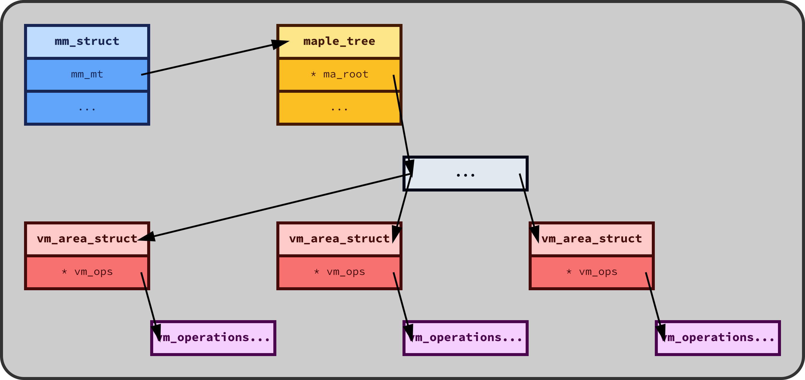
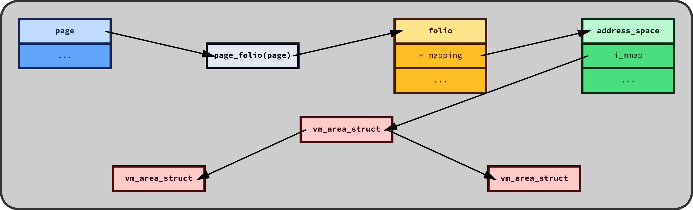
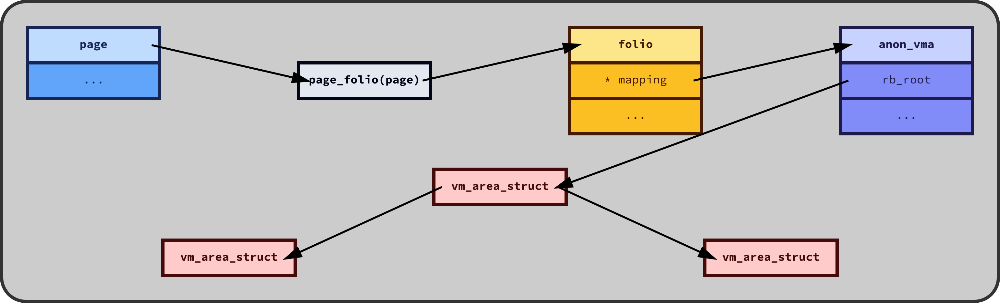

# Homework 2---Linux Page Cache

**Author: Cayden Lund (u1182408)**

Note that this document represents the current state of the Linux kernel and API at the time of writing, v6.11.0.


## Table of Contents

- [Virtual Memory Areas](#virtual-memory-areas)
- [Maple Trees for VMAs](#maple-trees-for-vmas)
- [Reverse Mapping to a Virtual Memory Area](#reverse-mapping-to-a-virtual-memory-area)
  - [Reverse Mapping for File-Mapped Memory](#reverse-mapping-for-file-mapped-memory)
  - [Reverse Mapping for Anonymous Memory](#reverse-mapping-for-anonymous-memory)
- [Address Spaces](#address-spaces)
- [Buffer Cache](#buffer-cache)
- [Paging and Page Faults](#paging-and-page-faults)
- [Page Swapping](#page-swapping)
  - [Swapping Out](#swapping-out)
  - [Swapping In](#swapping-in)


## Virtual Memory Areas

Linux systems use **virtual addresses** to abstractly represent addresses of physical memory.
This abstraction creates a large, contiguous, isolated address space for each process, which the kernel manages through various mechanisms, including page tables and virtual memory areas.

A process is represented in Linux by a `struct task_struct`, which I won't discuss in detail because it doesn't store any information that isn't in other data structures that I'll be diving into; the key property of it, though, is that it holds a `struct mm_struct`, which holds information about the process's virtual memory layout, defined in file [`include/linux/mm_types.h` (link to source)](https://elixir.bootlin.com/linux/v6.11/source/include/linux/mm_types.h#L779).
The relevant fields of this datatype are included below, with annotated descriptions:

```C
// Represents the virtual memory layout of a process.
struct mm_struct {
    // These are placed first because they're frequently updated
    // (cache optimization).
    struct {
        struct {
            // An atomic count of the number of references to this `mm_struct`.
            // When the count reaches 0, the `mm_struct` is freed.
            atomic_t mm_count;
        } ____cacheline_aligned_in_smp;

        // The maple tree (compare to the old red-black tree) of VMAs.
        struct maple_tree mm_mt;

        // The base address for `mmap()` mappings.
        unsigned long mmap_base;
        // The base address for `mmap()` mappings using legacy ("bottom-up")
        // allocation methods.
        unsigned long mmap_legacy_base;
        // The total size of the process's virtual memory space.
        unsigned long task_size;

        // A pointer to the top-level page directory for this process.
        pgd_t * pgd;

        // Tracks the number of user-space processes or threads using the memory.
        // When it drops to 0, it releases a reference on `mm_count`.
        atomic_t mm_users;

        // The total number of VMAs in the process.
        int map_count;

        // A simple spinlock to protect modifications to page tables
        // and some counters.
        spinlock_t page_table_lock;

        // A reader-writer semaphore to synchronize access to the VMA tree.
        // Follows the "concurrent readers, exclusive writer" model.
        struct rw_semaphore mmap_lock;

        // These store high-watermarks for the process's memory usage.
        // Tracks the highest "resident set size", the amount of physical memory
        // used by the process.
        unsigned long hiwater_rss;
        // Tracks the highest amount of virtual memory allocated.
        unsigned long hiwater_vm;

        // The total number of VM pages mapped by the process.
        unsigned long total_vm;
        // The number of pages that have been locked into physical memory
        // and can't be swapped out.
        unsigned long locked_vm;
        // A 64-bit atomic counter tracking the number of pages whose reference count
        // has been permanently incremented (i.e., "pinned").
        atomic64_t    pinned_vm;

        // A lock for the following fields.
        spinlock_t arg_lock;

        // The beginning and end of the executable and initialized data segments
        // of the program (respectively).
        unsigned long start_code, end_code, start_data, end_data;
        // The current end of the heap.
        unsigned long start_brk, brk, start_stack;

        // Architecture-specific memory management information.
        mm_context_t context;

        // Various flags related to memory management.
        unsigned long flags;

        // The user namespace associated with the process.
        struct user_namespace *user_ns;

        // A reference to the executable file for the process.
        struct file __rcu *exe_file;
    } __randomize_layout;

    // A dynamically-sized array tracking the CPUs that have executed parts
    // of the process.
    unsigned long cpu_bitmap[];
};
```

A key field here is `struct maple_tree mm_mt`, which holds all of the _virtual memory areas_ for the particular process.
I will go into more detail on maple trees later, but at a high level, it's a balanced search tree with good performance.

**Virtual memory areas** (VMAs) represent contiguous regions of virtual memory in a process's address space.
VMAs are used to map files, allocate memory, and set up shared memory.

A VMA is represented in the kernel by datatype `struct vm_area_struct`, defined in file [`include/linux/mm_types.h` (link to source)](https://elixir.bootlin.com/linux/v6.11/source/include/linux/mm_types.h#L664).
The relevant fields of this datatype are included below, with annotated descriptions:

```C
// Describes a virtual memory area.
// There is one of these for each virtual memory area, for each task.
struct vm_area_struct {
    struct {
        // The VMA covers virtual address starting at `vm_start`
        // and going up to `vm_end - 1`.
        unsigned long vm_start;
        unsigned long vm_end;
    };

    // This is a pointer to the address space that owns us.
    struct mm_struct *vm_mm;
    // Defines the access permissions of this VMA.
    pgprot_t vm_page_prot;

    // Various different virtual memory flags.
    const vm_flags_t vm_flags;

    // A pointer to the descriptor of this area's anonymous memory,
    // if this is an anonymous VMA.
    struct anon_vma *anon_vma;

    // Various different functions that are designed to work with this VMA.
    const struct vm_operations_struct *vm_ops;

    // Information about the backing store:
    // Offset in multiples of `PAGE_SIZE`.
    unsigned long vm_pgoff;
    // If this is a file-mapped page, then this is the file that we map to.
    // Otherwise, this is `NULL`.
    struct file * vm_file;
    void * vm_private_data;
};
```

Each VMA has a set of operations that can be performed on it, depending on the type of memory that it represents.
The kernel uses the functions defined for this VMA to perform tasks such as handling page faults, managing memory access, and making sure that the memory is properly synchronized with the backing store.
In the Linux source code, the datatype `struct vm_operations_struct` defines the operations set for a particular VMA, defined in file [`include/linux/mm.h` (link to source)](https://elixir.bootlin.com/linux/v6.11/source/include/linux/mm.h#L588).
I've included this datatype below, with in-depth annotations:

```C
// These are the functions for a virtual memory area, as a set of function pointers.
struct vm_operations_struct {
    // This is called whenever a new reference is created to a VMA
    // (e.g., through a process calling `fork()`).
    // Counter/lock setup is done here.
    void (*open)(struct vm_area_struct * area);

    // This is called when the VMA is being removed from the memory map,
    // such as when a process terminates or calls `munmap()`.
    // Releases resources, etc.
    void (*close)(struct vm_area_struct * area);

    // Before the kernel attempts to split a VMA into multiple regions,
    // this function is called to check whether splitting is allowed.
    // Returns 0 if the split is allowed, or an error status code otherwise.
    int (*may_split)(struct vm_area_struct *area, unsigned long addr);

    // Called when `mremap()` is resizing the memory region.
    int (*mremap)(struct vm_area_struct *area);

    // Does driver-specific or filesystem-specific checks to see whether
    // the protection flags of the VMA can safely be changed.
    int (*mprotect)(struct vm_area_struct *vma, unsigned long start,
            unsigned long end, unsigned long newflags);

    // Called when a page fault occurs.
    vm_fault_t (*fault)(struct vm_fault *vmf);
    // Like `fault`, but for huge pages.
    vm_fault_t (*huge_fault)(struct vm_fault *vmf, unsigned int order);

    // Allows for the kernel to map multiple contiguous pages at once.
    vm_fault_t (*map_pages)(struct vm_fault *vmf,
            pgoff_t start_pgoff, pgoff_t end_pgoff);

    // Returns the size of the pages in the VMA.
    // (Usually 4 KiB, unless it's huge pages.)
    unsigned long (*pagesize)(struct vm_area_struct * area);

    // Called when a previously-read-only page is about to become writable
    // due to a page fault.
    vm_fault_t (*page_mkwrite)(struct vm_fault *vmf);

    // Like `page_mkwrite` but for VMAs with specific flags that map
    // physical page frame numbers directly into userspace.
    vm_fault_t (*pfn_mkwrite)(struct vm_fault *vmf);

    // Called when the kernel needs to access a memory range.
    // Used for (for example) profiling and debugging.
    int (*access)(struct vm_area_struct *vma, unsigned long addr,
              void *buf, int len, int write);

    // A special name assigned to this VMA, or `NULL`.
    const char *(*name)(struct vm_area_struct *vma);

    // Finds the page for a particular address in the case that regular
    // reverse mapping is insufficient.
    struct page *(*find_special_page)(struct vm_area_struct *vma,
                      unsigned long addr);
};
```

All in all, the data structures look like this:

<p align="center">
    
</p>

_When the user tries to access a virtual address, a reverse mapping is done to find the right associated page.
Every process has a unique `mm_struct` describing it.
The `mm_struct` has a `maple_tree`, a balanced tree of all of its virtual memory areas.
Through traversing the VMA maple tree, we find the right `vm_area_struct` that contains that virtual address (or `NULL` if there is no such VMA).
Finally, each `vm_area_struct` has an associated `vm_operations_struct` that contains method pointers specific to that VMA._


## Maple Trees for VMAs

I'm excited to talk about this, because this is a very recent change!
Before now, the Linux kernel used a red-black tree to identify a particular virtual memory area quickly.
The VMAs are dynamically managed and need to be accessed, inserted, and deleted frequently, and the self-balancing red-black tree was quite effective at searching for an entry in the tree and performing updates to the tree with little overhead.
In addition to the red-black tree, each process memory descriptor (`mm_struct`) kept a doubly-linked list of the VMAs, sorted from the lowest address to highest address.

However, in kernel release v6.1.0, the red-black tree and the linked list were both removed and replaced with a new data structure: the **maple tree**, which was fast enough that the extra work for managing an additional linked list outweighed the potential benefits.
The maple tree is related to B-trees, and as such the nodes in the tree each contain multiple elements.
Specifically, leaf nodes can hold up to 16 elements, and internal nodes can hold up to 10.
This has a profound impact on runtime speed: elements can be inserted and removed frequently without having to re-balance the tree, because it can be done in this already-allocated space.
It also allows the tree to take advantage of CPU caches more efficiently: nodes in the tree require at most 256 bytes, which is a multiple of common cache line sizes.
Finally, perhaps the best performance advantage is that it was designed in concurrent contexts, using a read-copy-update model.

An interesting detail about the maple tree is that the developers found that the implementation was so performant that it was as fast as the VMA cache that was in use, which tracked most-recently-accessed VMAs for quick lookup.
Therefore, as a part of the introduction of the maple tree to manage VMAs, the VMA cache was completely removed.

In the kernel, maple trees are represented in the (very simple) data structure `struct maple_tree`, which is defined in file [`include/linux/maple_tree.h` (link to source)](https://elixir.bootlin.com/linux/v6.11/source/include/linux/maple_tree.h#L219).
The fields of this datatype are included below, with annotated descriptions:

```C
// A highly-performant balanced search tree
// for handling ranges of memory addresses.
struct maple_tree {
    // A mutex for synchronization.
    union {
        // Either use an internal spinlock, like so...
        spinlock_t ma_lock;

        // ...or use one externally.
        lockdep_map_p ma_external_lock;
    };

    // Flags providing information about the tree.
    unsigned int ma_flags;

    // A pointer to the root of the tree.
    void __rcu *ma_root;
};
```

The maple tree logic is defined in a few functions, which I work through below.

First, insertions are done using the `mtree_insert` function, which is implemented in file [`lib/maple_tree.c` (link to source)](https://elixir.bootlin.com/linux/v6.11/source/lib/maple_tree.c#L6446).

```C
// Inserts the given entry at the given index in the given maple tree,
// if there is not already such a value.
// Arguments:
//   - mt:     The maple tree.
//   - index:  The index where to store the value.
//   - entry:  The entry to store in the tree.
//   - gfp:    The `GFP_FLAGS` to use for allocations.
//
// Returns:
//   - `0` on success
//   - `-EEXISTS` if the range is occupied
//   - `-EINVAL` on an invalid request
//   - `-ENOMEM` if memory couldn't be allocated.
int mtree_insert(struct maple_tree *mt, unsigned long index, void *entry, gfp_t gfp) {
    // This simply defers to the `mtree_insert_range` implementation,
    // which inserts a range of values, and we give it a "range" containing
    // only this index.
    return mtree_insert_range(mt, index, index, entry, gfp); }
}
```

We'll jump to the [`mtree_insert_range` implementation](https://elixir.bootlin.com/linux/v6.11/source/lib/maple_tree.c#L6411):

```C
int mtree_insert(struct maple_tree *mt, unsigned long index, void *entry, gfp_t gfp) {
    // Initialize a new `mas_state` object named `ms`.
    // This macro basically works like a constructor,
    // initializing the fields to default values.
    // I've included this data structure below for reference.
    MA_STATE(ms, mt, first, last);

    // If the given `entry` is _advanced_, meaning that it's an invalid state
    // or was modified in an invalid way, then return.
    if (WARN_ON_ONCE(xa_is_advanced(entry)))
        return -EINVAL;

    // If the start of the range is after the end of the range,
    // then this is an invalid request.
    if (first > last)
        return -EINVAL;

    // Locks the modification of the maple tree.
    mtree_lock(mt);

    // Try to insert `entry` into the maple tree.
retry:
    mas_insert(&ms, entry);

    // Did it fail because of a memory allocation issue?
    // If so, try again.
    if (mas_nomem(&ms, gfp))
        goto retry;

    // Now that the maple tree has been updated, unlock it so that others
    // can modify it now if needed.
    mtree_unlock(mt);

    // If there was an error, then report it to the user...
    if (mas_is_err(&ms))
        return xa_err(ms.node);

    // ...otherwise, return 0 ("OK").
    return 0;
}
```

The `ma_state` datatype is defined in file [`include/linux/maple_tree.h` (link to source)](https://elixir.bootlin.com/linux/v6.11/source/include/linux/maple_tree.h#L426):

```C
struct ma_state {
    // A pointer to the tree that we're working in.
    struct maple_tree *tree;

    // The index where we're working---start of the range.
    unsigned long index;
    // The last index of the range where we're working.
    unsigned long last;

    // The maple node containing this entry.
    struct maple_enode *node;

    // The minimum index of this node.
    // This is an implied pivot minimum.
    unsigned long min;
    // The maximum index of this node.
    // This is an implied pivot maximum.
    unsigned long max;

    // The nodes that were allocated for this operation.
    struct maple_alloc *alloc;

    // The current state of the operation.
    enum maple_status status;

    // The depth of the tree descent.
    unsigned char depth;

    unsigned char offset;
    unsigned char mas_flags;

    // The end of the maple node (byte index).
    unsigned char end;
};
```

Fetching values from the maple tree works in a similar way.
Function `mtree_load` is implemented in file [`lib/maple_tree.c` (link to source)](https://elixir.bootlin.com/linux/v6.11/source/lib/maple_tree.c#L6314)

```C
// Gets the value at the given index from the given maple tree.
// Returns the relevant entry, or `NULL`.
void *mtree_load(struct maple_tree *mt, unsigned long index) {
    // Once again, initialize a new `mas_state` object.
    // This time, it's named `mas` instead of `ms`.
    // I'm curious whether that's intentional.
    MA_STATE(mas, mt, index, index);

    // This will hold the value to return.
    void *entry;

    // This is probably for performance analysis or debugging.
    trace_ma_read(__func__, &mas);

    // Lock the tree for read access (under the RCU model).
    rcu_read_lock();

retry:
    // Start the traversal of the maple tree.
    // It returns the value if found, or reports the status.
    entry = mas_start(&mas);

    // If there was no entry at that index, then unlock the tree
    // and return `NULL`.
    if (unlikely(mas_is_none(&mas)))
        goto unlock;

    // If the current entry is a pointer that might contain further data structures:
    // if `index` is non-zero, then unlock and return `NULL`.
    // Otherwise, just unlock and return the entry.
    if (unlikely(mas_is_ptr(&mas))) {
        if (index)
            entry = NULL;

        goto unlock;
    }

    // Otherwise, perform the actual tree traversal.
    entry = mtree_lookup_walk(&mas);
    // If the lookup failed for some reason, then the traversal is still at the start,
    // so try it again.
    if (!entry && unlikely(mas_is_start(&mas)))
        goto retry;

unlock:
    // Unlock the maple tree.
    rcu_read_unlock();

    // Return the entry if found, or `NULL` otherwise.
    if (xa_is_zero(entry))
        return NULL;

    return entry;
}
```

I could talk about maple trees all day.
I find this really interesting.


## Reverse Mapping to a Virtual Memory Area

At a high level, **reverse mapping** is the ability to trace from the physical page frame back to the virtual memory areas that map to it.
This lets the kernel identify all processes and VMAs that have a particular page mapped, which lets it decide whether it's safe to drop pages, swap them to disk, or other memory operations.

Given a `struct page`, the first thing that needs to be done is to identify the _folio_ that owns it.
**Folios** are a recently-added abstraction that represents a collection of pages that are physically, virtually, and logically contiguous.
Every `struct page` is owned by a `struct folio`, even if it's only a single page.
The `struct folio` datatype is defined in file [`include/linux/mm_types.h` (link to source)](https://elixir.bootlin.com/linux/v6.11/source/include/linux/mm_types.h#L324).
Public fields are included below, with added annotations:

```C
// Represents a collection of pages.
struct folio {
    struct {
        // Same as the page flags.
        // Tracks various attributes and states of the folio.
        unsigned long flags;

        // A linked list that manages the folio in least-recently-used caches.
        // Lets the kernel make informed decisions about memory eviction.
        struct list_head lru;

        struct {
            // Number of times this folio has been pinned by `mlock()`.
            // Incremented every time the folio gets pinned.
            unsigned int mlock_count;
        };

        // File:  This is the file it belongs to.
        // Anonymous memory: Refers to the `anon_vma`.
        struct address_space *mapping;

        // File:  The offset within the file, in units of pages.
        // Anonymous memory:  The index from the beginning of the mmap.
        pgoff_t index;

        union {
            // Filesystem per-folio data.
            // Saves some additional metadata of the folio as an entry
            // in the filesystem.
            void *private;

            // Used for `swp_entry_t` if `folio_test_swapcache()`.
            // If the folio is in swap cache, this field points to the location
            // of the swapped page.
            swp_entry_t swap;
        };
    };
};
```

We can get the `struct folio` for a given `struct page` by calling the method `page_folio(page)`.

There are two types of virtual memory areas: _anonymous memory_ and _file-mapped memory_.

**File-mapped memory** is memory that is backed by files, used for shared memory regions (such as for shared libraries) and memory-mapped files.
This is allocated with `mmap()` with a file descriptor.
When a VMA is file-mapped memory, then the `vm_file` field of the associated `struct vm_area_struct` representing that VMA is set to the relevant file.

On the other hand, **anonymous memory** is not backed by a file, such as pages allocated for the heap or the stack.
This is usually allocated with `brk()`, `sbrk()`, or `mmap()` without a file descriptor.
When a VMA is anonymous memory, then the `anon_vma` field of the the associated `struct vm_area_struct` representing that VMA is set to the relevant `struct anon_vma` describing that anonymous memory area.

To make this more clear, I've prepared an illustration:

<p align="center">
    
    <br />
    <i>If the <code>vm_area_struct</code> is mapped to a file, then the <code>vm_file</code> field will point to the mapped file.</i>
    <br />
    <i>Otherwise, the <code>vm_area_struct</code> represents anonymous memory, and the <code>anon_vma</code> field points to the relevant <code>anon_vma</code> that describes it.</i>
</p>

With that out of the way, the next step is to identify whether this particular folio is file-mapped memory or anonymous memory.
We can simply do this with a call to `folio_test_anon(folio)`.

What happens next depends on whether the folio is file-mapped or anonymous memory.


### Reverse Mapping for File-Mapped Memory

The kernel then uses the `folio->mapping` field.
For file-mapped folios, this is a pointer to an `address_space` structure associated with that file.

Let's examine this data structure. 
It represents the mapping between a file and its memory pages.
It's defined in file [`include/linux/fs.h` (link to source)](https://elixir.bootlin.com/linux/v6.11/source/include/linux/fs.h#L466).
I've included the relevant fields below, with annotations:

```C
// Represents the mapping between a file and its memory pages.
struct address_space {
    // A pointer to the `inode` structure that represents the file or device
    // associated with this `address_space`.
    // The `inode` structure contains metadata about the file,
    // including its size, permissions, and timestamps.
    struct inode *host;

    // A radix-tree-based data structure.
    // It can efficiently store and retrieve pages of memory.
    // It holds the mapping from the file offset to the corresponding
    // in-memory pages.
    struct xarray i_pages;

    // A read-write semaphore used to protect this `address_space`
    // when invalidating pages (e.g., when unmapping pages from the page cache).
    struct rw_semaphore invalidate_lock;

    // The "Get Free Pages" flags---they specify how memory allocations for this space
    // should be performed.
    // E.g., states whether pages should be allocated from the page cache
    // or from elsewhere.
    gfp_t gfp_mask;

    // A counter that tracks how many writable memory-mapped regions are associated
    // with this `address_space`.
    atomic_t i_mmap_writable;

    // Represents a red-black binary search tree of VMAs that map this address space.
    struct rb_root_cached i_mmap;

    // The number of pages currently loaded into memory for this `address_space`.
    // (I.e., how many pages from the file are currently in the RAM.)
    unsigned long nrpages;

    // The page index where writeback operations should resume
    // (i.e., writing dirty pages from memory back to disk).
    pgoff_t writeback_index;

    // Function pointers that define operations for this `address_space`.
    // E.g., reading, writing, memory management functions.
    const struct address_space_operations *a_ops;

    // Flags that manage the state of this `address_space`.
    // E.g., whether it's dirty or clean, etc.
    unsigned long flags;

    // Tracks writeback errors that occur while writing data to the file
    // associated with this `address_space`.
    errseq_t wb_err;

    // A lock for the `i_private_list` field.
    spinlock_t i_private_lock;
    // A linked list of private data associated with the `address_space`.
    // E.g., pages, other metadata external to the mapped data that need
    // to be managed outside the normal page cache.
    struct list_head i_private_list;

    // A read-write semaphore for the `i_mmap` tree.
    struct rw_semaphore i_mmap_rwsem;

    // A generic pointer to private data associated with this `address_space`.
    void * i_private_data;
};
```

Once we have a `struct address_space` object, we can get all VMAs that map to this folio of memory through the field `rb_root`, a red-black tree.
As such, the kernel can lookup all virtual memory areas across all threads that map to a file-mapped page.

<p align="center">
    
</p>


### Reverse Mapping for Anonymous Memory

Again, the kernel then uses the `folio->mapping` field.
For anonymously-mapped folios, though, this is a pointer to a `struct anon_vma` structure, which keeps track of the VMAs that refer to the same set of pages; it's defined in file [`include/linux/rmap.h` (link to source)](https://elixir.bootlin.com/linux/v6.11/source/include/linux/rmap.h#L31).
The relevant fields are included below, with annotations:

```C
struct anon_vma {
    // Pointer to the root `anon_vma` in a hierarchy of anonymous VMAs.
    // This facilitates sharing anonymous VMAs across multiple processes
    // (e.g., after a call to `fork()`).
    struct anon_vma *root;

    // This is a read-write semaphore for controlling access to this `anon_vma`.
    struct rw_semaphore rwsem;

    // This is an atomic reference counter that tracks the number of active
    // references to this virtual memory area.
    atomic_t refcount;

    // A counter of all of this tree node's children, including itself.
    unsigned long num_children;

    // A counter of the number of VMAs that actively map to this `anon_vma`.
    unsigned long num_active_vmas;

    // The parent node in the hierarchy.
    struct anon_vma *parent;

    // This is a red-black tree that stores and retrieves VMAs
    // mapping to this `anon_vma`.
    struct rb_root_cached rb_root;
};
```

This `anon_vma` structure directly refers to all VMAs that map to that folio of memory through its red-black tree in field `rb_root`.
This allows the kernel to traverse from a physical page back to the page table entries in the processes' address spaces that map it.
This means that, given a physical page frame descriptor, we can identify whether it's actively being used by processes, which needs to be done to invalidate or update page table entries every time a page gets reclaimed or migrated.

<p align="center">
    
</p>


## Address Spaces

The **address space** refers to the range of memory addresses that a process can access.
In Linux, each process has its own virtual address space, which emulates the physical address space on the machine, and there's a layer of indirection with page tables and hardware mechanisms (i.e., the MMU).
This technique gives each process the illusion that it has access to the entire memory space, but in reality only segments of the address space are mapped.
This ensures that processes can't access each other's memory (which has security vulnerability implications), and it also allows programs to be compiled with jumps to static addresses and with references to static addresses, which has runtime benefits and is also much easier to debug.

Virtual memory abstracts physical memory into logical chunks (described by `struct page`).
Like I said before, each process believes that it has access to a large, contiguous block of memory, but behind the scenes, only a portion of the pages in the virtual address space has a mapping to a corresponding physical page.

In Linux, the address space is divided into _user space_ and _kernel space_.
On 64-bit architectures, the first 16 bits of an address will be set to `0` if it's an address into the user space, or set to `1` otherwise.
Like I said before, all processes have their own virtual memory space (in the user space), but the kernel virtual address space is shared across all processes.

The virtual address space of a process is broken up into segments.
These segments are defined by the virtual memory areas (described by `struct vm_area_struct`, as shown above).
Each process has its own `struct mm_struct` instance to describe its address space, which contains the set of `struct vm_area_struct` describing the different areas, and also has a reference to the top-level page directory, file descriptors for any memory-mapped files, swap information, and more.

`struct vm_area_struct` describes a contiguous subset of the virtual address space.
It tracks the start and end addresses of its memory region, flags governing the permissions and state of the VMA, a pointer to the file if it's a memory-mapped file, and a pointer to a descriptor of an anonymous memory space otherwise.


## Buffer Cache

The buffer cache sits between the kernel's filesystem operations and physical I/O.
It caches frequently-accessed disk blocks in memory, reducing the frequency of direct disk access and improving I/O performance.

The **buffer head** (`struct buffer_head`) is the core structure of the buffer cache.
It's defined in file [`include/linux/buffer_head.h` (link to source)](https://elixir.bootlin.com/linux/v6.11/source/include/linux/buffer_head.h#L59).
Here is the definition, with annotations:

```C
struct buffer_head {
    // Represents the state of the buffer as a bitmap.
    // Tracks whether it's dirty, up-to-date, locked, etc.
    unsigned long b_state;

    // This is a circular linked list of all buffer heads associated
    // with the same page.
    struct buffer_head *b_this_page;

    // This points to either the page or the folio structure
    // that this buffer is mapped to.
    union {
        struct page *b_page;
        struct folio *b_folio;
    };

    // This is the starting block number on the device for this buffer.
    // This maps the buffer to the corresponding location on the device.
    sector_t b_blocknr;

    // The size of the buffer, in bytes.
    size_t b_size;

    // A pointer to the actual data within the page.
    char *b_data;

    // Points to the `block_device` (device descriptor) that this buffer
    // is associated with.
    struct block_device *b_bdev;

    // This is a function pointer to the I/O completion routine.
    // It gets called whenever an I/O operation on the buffer completes.
    bh_end_io_t *b_end_io;
    // This is a pointer to some arbitrary data that the user can set to something
    // for the `b_end_io` function to use.
    void *b_private;

    // A linked list of buffers associated with the same inode.
    struct list_head b_assoc_buffers;

    // Points to the `address_space` structure that this buffer is associated with.
    struct address_space *b_assoc_map;

    // The number of users of this buffer head.
    // Used to make sure that it doesn't get allocated while still in use.
    atomic_t b_count;

    // Serializes I/O completion of buffers in the same page.
    spinlock_t b_uptodate_lock;
};
```


## Paging and Page Faults

I went quite into detail on paging in assignment 1, so here's a fairly thorough summary, and you can refer to homework 1 for details.

The Linux kernel divides memory into _pages_, blocks of `PAGE_SIZE` (4 KiB, with a few exceptions).
Pages are described by the datatype `struct page`; each page has its own descriptor in an array.
The Buddy allocator is used to allocate and free memory pages.

Virtual addresses are an abstraction for real physical memory addresses.
See section "Address Spaces" above for more information.
The virtual address space is composed of mappings from virtual pages to physical pages.
These mappings are recorded in the hierarchical _page table;_ each process has its own page table.

The virtual address space is typically far larger than physical memory actually exists on the system.
Only certain areas within the address space are mapped to corresponding physical pages.
When a process attempts to load from or store to a virtual address, the CPU traverses the page table to find the corresponding physical mapping for that virtual address.
If the virtual address didn't have a mapped physical page (i.e., there isn't an entry in the page table for that virtual address), or if the page wasn't present in physical memory, a _page fault_ is triggered.

On a **page fault**, where a process tries to dereference a virtual address that doesn't have a corresponding physical address, the CPU generates a page fault exception, and the kernel's fault handler takes over.
The kernel records the context of the current process, including the program counter and register values.
The kernel's handler checks the page tables to see whether the page fault was caused by a missing page (perhaps the page was _swapped_ to disk, or the page is a memory-mapped file that hasn't been loaded yet); if so, then the handler will load that page, update the page tables, and transfer control back to the process.
If the page fault was caused by an _invalid access_ (i.e., accessing a page that isn't permitted), then the handler terminates the process.

When the kernel's handler needs to load a page from the disk, it first needs to find a free physical page.
If there isn't one, then it will pick a page that hasn't been accessed recently and swap it to the disk.
Then, it reads the respective page from the disk into the free physical page frame.

Note that the kernel loads pages into memory when they're accessed, not beforehand.
This helps the system to not get saturated with allocated pages of memory that aren't being used yet.


## Page Swapping

**Page swapping** (sometimes referred to as simply _paging_) is the process of moving page frames from physical RAM to a secondary storage medium (usually a hard drive) or vice versa.
The idea is that frequently-used memory can stay in the RAM, while infrequently-used memory can spend most of its time in the secondary storage medium, which will keep the (much) faster RAM available for allocations.

### Swapping Out

Linux uses a variation of a _Least-recently used_ list for page replacement.
Every time a page is used, it gets moved to the end of the list.
It keeps track of "active" (frequently accessed) and "inactive" (haven't been accessed in a long time) pages separately.
Then, when a page needs to be freed to make space for another allocation, the lists are sorted approximately in order from least-used to most-used, and pages from the inactive list are candidates for swapping to disk.

If the candidate page is marked as "clean", meaning that it hasn't been modified since the last time it was loaded from the disk, it can immediately be swapped out.
Otherwise, the page is "dirty", and the page's new, updated value is written back to the original backing store (e.g., a file for memory-mapped files).

Finally, when a page is swapped out, it gets recorded in the kernel's _swap map_.

### Swapping In

When a process accesses a page that has been swapped out, a _page fault_ occurs, and the kernel will load the page back into RAM before returning control back to the process.
The _swap map_ tells the kernel where to find the exact disk location of the swapped-out page.

Before the page is loaded into memory, a free physical page frame needs to be allocated as the destination.
If the system is running low on memory, then an "inactive" page will get swapped out to the disk, and the newly-freed page frame is allocated as the destination.

Then, the kernel loads the data from the disk and copies it into the page frame.
Finally, it updates the process's page tables to record that the page is now present in RAM.
